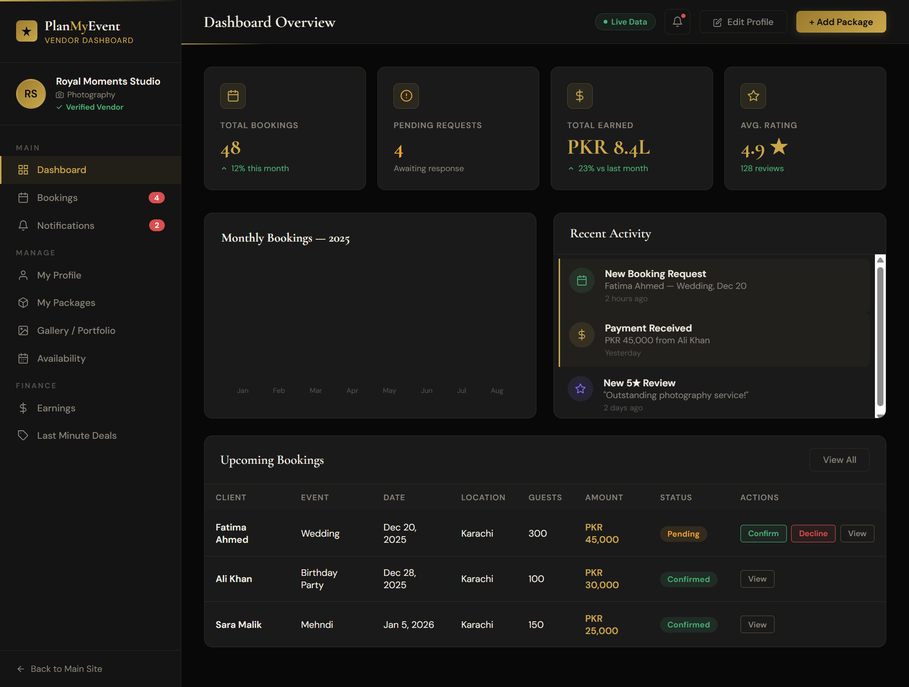
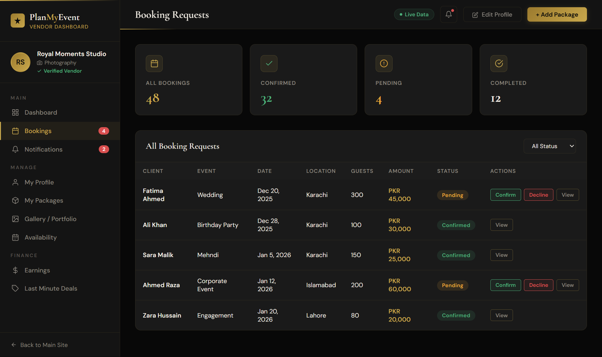
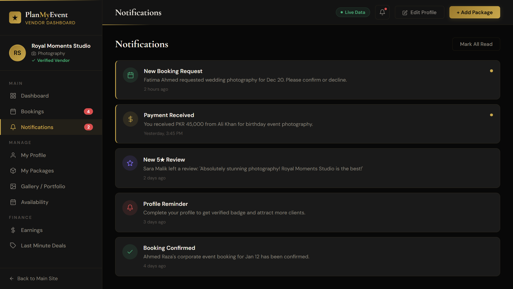
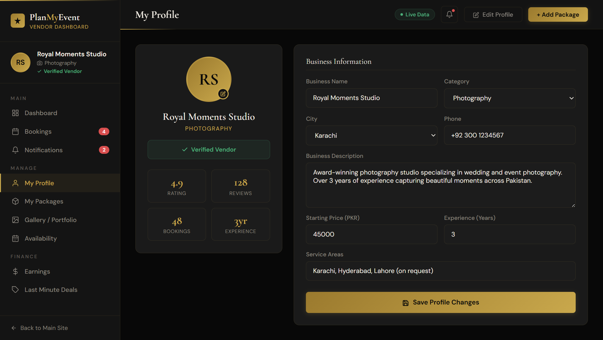
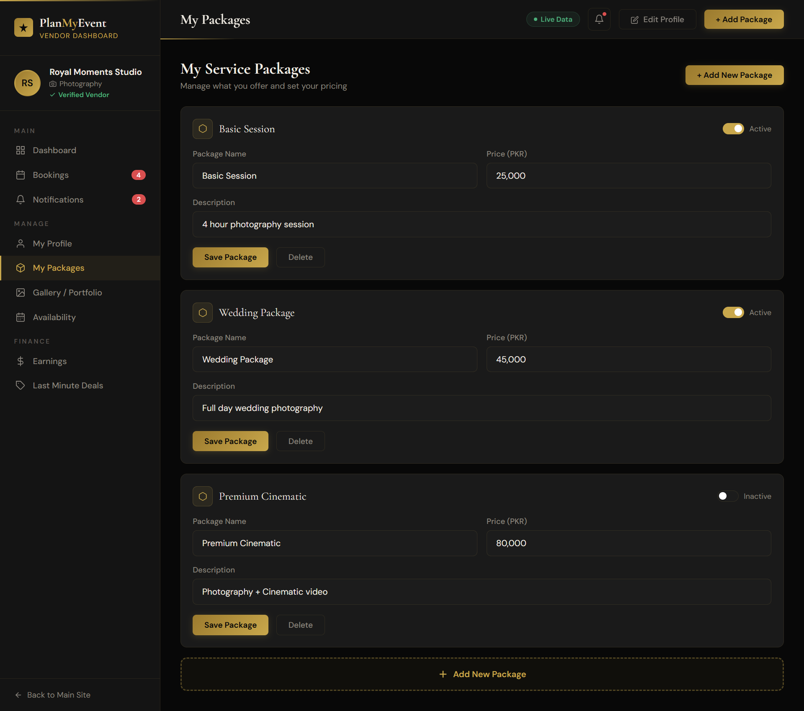
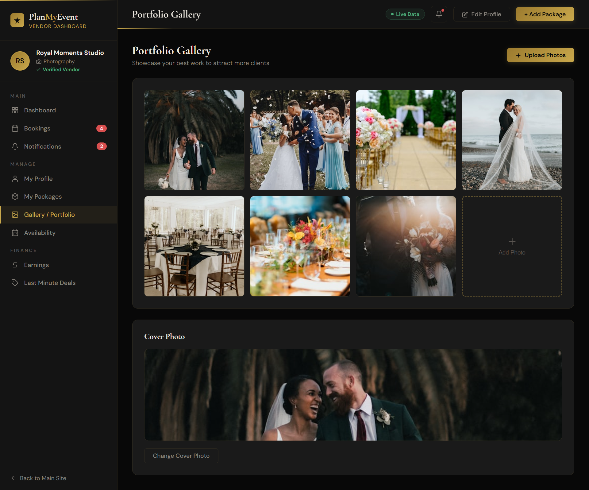
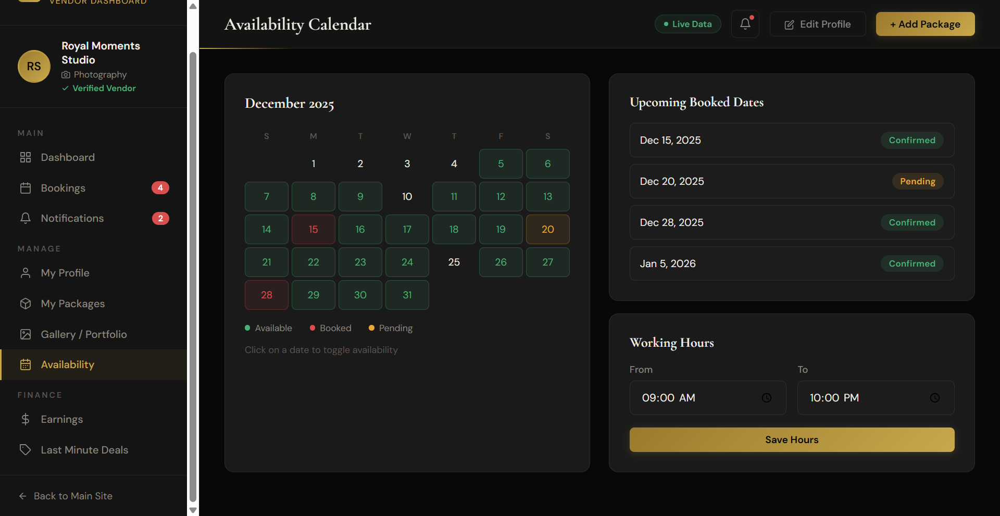
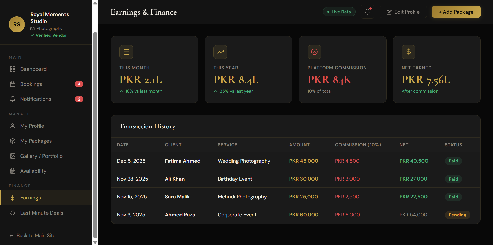
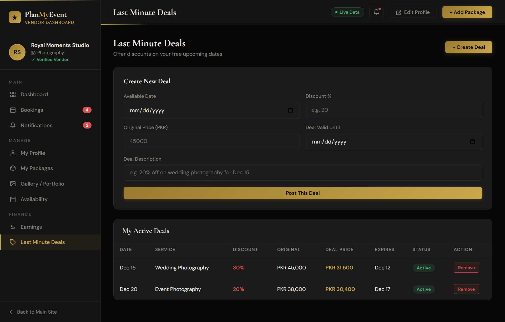

# PlanMyEvent – Smart Event Planning Platform

## Project Overview

PlanMyEvent is a modern event planning platform designed to simplify the entire event planning process through a single, user-friendly platform. It connects customers with verified vendors, event halls, photographers, decorators, caterers, and other service providers, allowing users to discover, compare, and book event services efficiently.

The platform helps users organize weddings, birthdays, engagements, corporate events, and other celebrations while reducing the time, cost, and complexity of traditional event planning.

This repository contains the frontend UI prototype of the platform, demonstrating its interface, user experience, and core functionalities.

---

## Features

- Vendor Search
- Price Comparison
- Booking System
- Verified Vendors
- 360° Virtual Venue Tours
- AI Budget Planner
- Live Availability Calendar
- Vendor Bidding System
- Event Package Bundles
- Guest Management System
- Event Countdown Dashboard
- Last-Minute Deals

---

## Vendor Dashboard

The vendor dashboard provides dedicated tools for managing business operations and customer interactions.

Features include:

- Dashboard Overview
- Booking Requests
- Notifications
- My Profile
- My Packages
- Gallery / Portfolio
- Availability Calendar
- Earnings & Finance
- Last-Minute Deals Management

---

## Technologies Used

- HTML5
- Tailwind CSS
- JavaScript
- Responsive Web Design

---

## Screenshots

### Homepage

---

### Dashboard

---

### Booking Requests

---

### Notifications

---

### Vendor Profile

---

### My Packages

---

### Gallery / Portfolio

---

### Availability Calendar

---

### Earnings & Finance

---

### Last-Minute Deals

---

## Future Scope

- Secure online payment integration
- AI-powered vendor recommendations
- Real-time messaging between customers and vendors
- Customer reviews and rating system
- Mobile application
- Admin dashboard
- Multi-language support
- Interactive event planning assistant

---

## Author

**Nisha Lohana**

Computer Science Graduate | Web Developer | UI/UX Designer | 3D Modeller
